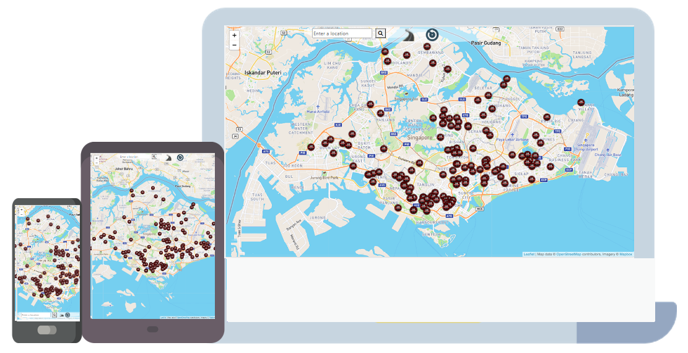

# Interactive Map Application Project

# **Hawker Centers Nearby**
## Context
This project includes writing custom HTML5, CSS3 and Vanila JavaScript code to create a webpage that serve the following purpose:
* Show the user where are the location of the Hawker Center in Singapore.
* Display current location of the user and find the nearest Hawker Center to the current location.
* Allow users to enter any location in the search bar and choose location from the search result, and find the nearest Hawker Center to the chosen location.

User's goal: To find the nearest Hawker Center based on their current location or chosen location.


## Access
Url to live site: https://honggao59.github.io/Hawker_Center_Nearby/




# Defining the Project
The purpose of this website is to aid users in the process of deciding how to find the location of the nearest Hawker Center.

Especially many people go to Hawker Center for dinning or takeaway during COVID when restaurants are closed down.

By using the map, it will help users to find the nearest Hawker Center.

# Strategy
## Identifying External Users
With the primary purpose mentioned above, the website's primary users could be included but not limited to: Tourists, locals who dont eat at home or not able to eat resturants during COVID etc. 

## Identifying External Users' Goals
The users' goal here is to find the nearest Hawker center on mapa according to their current position or selected position.

Therefore, the interface should be simple to understand and easy to interact with.

```
1. See all Hawker Center location.
2. If they want to find the Hawker Center near their currnet location, find out which one is closest from their current location.
3. If they want to find the Hawker Center near their selected location by searching on the map, find out which one is closest from their selected location.
4. Click on the Hawker Center and find out the details
5. To decided how to get their on the map.
```

## Identifying Users Pain Point
With the pax restrictions and inconvinience of travelling controlled by government during the COVID. Users find themselves with the following pain points.

```
1. People used to eat outside, now might need to find the nearest Hawker Center to eat.
2. Many resturants got shut down due to Covid, less numbers of dining places makes Hawker Center more popolar place to search for.
3. Difficult for tourist to find the Hawker Center for cheaper food
```

## Identifying Site Owner's Goals
As a start of my journey to become a software developer. My goal as the site owner is to showcase my proficiency in HTML5/CSS3/Vanila JavaScript.

```
1.Showcase my proficiency in HTML5/CSS3/Vanila JavaScript.
2. Provide a platform to solve users pain point
```

## User stories
```
As a user, I want to:
1. look at all the Hawker Center, so that I know where are they located.
2. know which Hawker Center is closest to me, so that I avoid travelling too far.
3. see the details location of the Hawker Center chosen, so that I know what the Hawker Center called and share with others.
4. know which is the nearest Hawker Center of the selected location rather than my current location (could also due to users dont want to enable his location etc.).
5. start searching new locations without refreshing the webpage.
```

# Scope
## Functional Requirement
```
1. Intreactive map to satisfy user need.
2. User can enable his location and use it and find the nearest Hawker Center.
3. If User does not want to enable his location, he could also able to find the nearest Hawker Center by searching his location.
4. User is able to find the name and address of the Hawker Center so he/she can share with others for where to dine.
5. User is able to start new searching by click the reset button back to the center of the map
6. Mobile responsive to decides such as Phone, Tablet and Laptop.
7. Use advance CSS/JavaScript to showcase proficiency.
```

## Non-Functional Requirement
```
NFR01. Ensure readability.
NFR02. For security purpose, location of users should not be stored.
```

## Content Requirement
### Mandatory Requirement
The list below contains the mandatory requirement for the site to meet all of the users goals

```
Interactive Map.
1. Location finder.
2. Distance calculator. (To calculate nearest Hawker Center)
3. Information Table. (Static Dataset such as Address, Postal Code, Name)
4. Search bar. (Search the location)
5. Reset the map to the original view
```

### Optional Requirement
The list below are optional requirements that can be implemented to enhance the site's feature.

They may not be implemented due to various reasons. (Eg, authorisation, access to system/domains)

```
Show the distance and route between the selected/current location and the nearest Hawker Center.
Show the various food available for each Hawker Center.
Show the time needed travel from the selected/current location to the nearest Hawker Center.
```

# Structure
## Content Information
Information that are required to fulfil the mandatory content requirement.

Some information will be shared across different pages.

### Information required on the interactive map
```
Search bar
Postal code
Name of the location.
Name of the Hawker Center.
```

### Image required
```
Custom pins to denote each Hawker Center.
Custom pin to denote current location when enabled.
Buttons to represent and navigate to Hawker Center.
Buttons to reset to the original map view.
```


## Content Structure
The content structure of this page will follow a **LINEAR STRUCTURE**.

Home Page (Map page)

Map Page:
    * The page will have one section that contains the map and an overlay of nav bar. 
    * Map will show the overview of the entire singapore with location of all Hawker Centers being pinned.
    * Nav bar will contain the following. 
        1) Search bar that user can search a location. 
        2) A button to search the location.
        3) A button to get the location of the user and show the nearest Hawker Center. 
        4) A button to reset to the original map view. 


# Skeleton
## Interface Design
Page will adopt a layout to fulfil the content information required.

## Map Page
This page will focus on the map function and interaction with the map. 

Nav bar is intentionally placed at the bottom of the page so that mobile users can access them easily. 

The nav bar will move to the top when it is on desktop/laptop view. 

### Map
* Postal code
* Name of the location.
* Name of the Hawker Center.
* Location of the user

### Nav bar
* Search Bar
* Find the nearest Hawker Center
* Reset

On the map Page, the nav bar will be at the top for laptop and desktop view. For mobile and tablet view, the nav bar will be at the bottom. 


# Surface
## Color
On the Home Page, as most of the space is covered by the map. Nav bar has been made transparent, and all the Icons are PNG file with transparent backgrounds

Therefore, the transparent nav bar and PNG image files will not block of any information.

Hawker Center icon was chosen in black and red so easier to spot on the map.

The icons on the Nav bar are also chosen in black so easier to spot on the map.

The current location icon was chosen in blue and red, easier to spot on the map.

Color of the information is in common black, making it easy for users to read. 

## Fonts
<link rel="stylesheet" href="https://cdnjs.cloudflare.com/ajax/libs/font-awesome/6.0.0-beta2/css/all.min.css"><link rel="stylesheet" href="style.css">
Fond awesome is used as part of the search bar

Information of the Hawker Center, the title of the Hawker Centers and Street name is highlighted

## Responsiveness
The webpage is responsive across various devices from desktop and laptop to phones and tablets. The component will automatically re-arrange itself based on the screen size.

Reccommended view for phone and tablets is in portrait mode. 

## Map overview
With the aid of map information can be seen at a glance without the need of inputs from the user. 

Only when specific information is needed the user will require to carry out input. Eg, nearest outlet from current location.


# Testing
## Functionality Test
## Map Page
|Category |Input/Actions | Output/Errors |
|---------|-----------------------------|---------------------|
|Overall | Mobile Responsive Check| No display error|
|Map Function| On load | Display all Hawker Centers with pins|
| | Clicking on location pin| Display key information information such as name of the Hawker Center and Postal code|
| | Zooming in and out on various device| No display error|
|Nav Bar| Type the location in the search bar| all possible location plot on the map|
| | Select the location from the search results| Map zoom to nearest Hawker Center location of the selected location|
| | Clicking on find the nearest Hawker Center button| Prompt user to allow access of location|
| | If allow access of location| Map plots a new marker with the current location of user and zoom to nearest Hawker Center location|
| | Clicking on the reset button | Map return to the original view|

# Deployment
Ensured all changes has been save and pushed to GitHub.

Hawker_Center_Nearby is deployed to Github. All icons and images used in the project are stored together.

# Technologies
In this application HTML5 is used to structure the content, CSS3 for styling and Vanila JavaScript to process data.

By using Bootstrap, mobile responsive design is made easier with the row-col system. 

Several other tools that played a role in this application:

For API,
* [Axios](https://github.com/axios/axios)

For map,
* [Leaflet](https://leafletjs.com/)
* [Leaflet Geometry.Util](https://github.com/makinacorpus/Leaflet.GeometryUtil)

For styling,
* [Bootstrap](https://getbootstrap.com/docs/4.0/getting-started/introduction/)
* [Font Awesome](https://fontawesome.com/)

For deployment,
* [Github](https://github.com/)

# Data
* [Hawker Center](https://data.gov.sg/)

# Acknowledgments
Many thanks the teachers for all the helps and suggestions through out the way
* Ace Liang 
* Neel
* Paul Chor
* Arif
